# Codelatch — Architecture

> Telegram buzzes when Claude Code needs you, and you can answer without opening your laptop.

---

## Overview

Codelatch is a local supervision broker for Claude Code. It intercepts lifecycle events from Claude Code sessions — questions, permission prompts, failures, completions — and relays them to Telegram. You respond from your phone. Claude continues.

The system is built on five existing primitives that tessellate perfectly: **Claude Code hooks**, **Claude Code plugins**, **Telegram Bot API**, **tmux**, and **Unix sockets**. Codelatch's own code is translation and routing between them.

---

## System Topology

```
┌─────────────────────────────────────────────────────────┐
│                      Your Laptop                        │
│                                                         │
│  ┌──────────────────────────────────────────────────┐   │
│  │                 tmux session                      │   │
│  │  ┌────────────────────────────────────────────┐  │   │
│  │  │           Claude Code session              │  │   │
│  │  │                                            │  │   │
│  │  │  hook fires ──► codelatch hook <event>     │  │   │
│  │  │                       │                    │  │   │
│  │  │                       │ JSON via stdin     │  │   │
│  │  └───────────────────────│────────────────────┘  │   │
│  │                          │                       │   │
│  └──────────────────────────│───────────────────────┘   │
│                             │                           │
│                    Unix socket IPC                      │
│                    (length-delimited)                   │
│                             │                           │
│                             ▼                           │
│  ┌──────────────────────────────────────────────────┐   │
│  │                  codelatchd                       │   │
│  │                                                   │   │
│  │  ┌─────────┐  ┌──────────┐  ┌────────────────┐  │   │
│  │  │  IPC    │  │ Telegram │  │    tmux        │  │   │
│  │  │ Server  │  │Transport │  │  Control Plane │  │   │
│  │  └────┬────┘  └────┬─────┘  └───────┬────────┘  │   │
│  │       │             │                │           │   │
│  │  ┌────┴─────────────┴────────────────┴────────┐  │   │
│  │  │              Event Router                  │  │   │
│  │  │     ┌──────────────────────────┐           │  │   │
│  │  │     │    SQLite (sessions,     │           │  │   │
│  │  │     │    pending_requests)     │           │  │   │
│  │  │     └──────────────────────────┘           │  │   │
│  │  └────────────────────────────────────────────┘  │   │
│  └──────────────────────────────────────────────────┘   │
│                             │                           │
│                    outbound HTTPS only                  │
│                    (no inbound ports)                   │
└─────────────────────────────│───────────────────────────┘
                              │
                              ▼
                    ┌─────────────────┐
                    │  Telegram API   │
                    │  (long polling) │
                    └────────┬────────┘
                             │
                             ▼
                    ┌─────────────────┐
                    │   Your Phone    │
                    │   (Telegram)    │
                    └─────────────────┘
```

---

## Components

### 1. `codelatch` — Wrapper Command (Session Launcher)

The primary user entry point. An alias for `codelatch run`.

**Responsibilities:**

| Step | Action |
|------|--------|
| 1 | Generate a `session_id` (ULID) |
| 2 | Derive a human-readable `name`: `<repo_basename>-<ulid_suffix>` (e.g. `api-server-9F2KQ1`) |
| 3 | Create a deterministic tmux session: `codelatch:<name>:<session_id>` |
| 4 | Launch Claude Code inside the tmux pane with injected environment |
| 5 | Optionally sanity-check daemon connectivity and warn if down |

**Environment variables injected into the tmux pane:**

```
CODELATCH_SESSION_ID=<ulid>
CODELATCH_SESSION_NAME=<name>
CODELATCH_SOCKET=/tmp/codelatch.sock    # or XDG runtime dir
```

**First-run behavior:**

On first invocation, if no config exists, `codelatch` acts as an installer:

```
1. Prompt: Telegram bot token (paste from BotFather)
2. Pairing: display bot handle + deep link → user taps Start
3. Confirm: Paired ✅ · Hooks installed ✅ · Daemon running ✅
4. Immediately start the first managed Claude Code session
```

After setup, subsequent invocations are quiet — print session name and attach.

---

### 2. `codelatchd` — Daemon (Supervision Broker)

A long-running Rust binary managed as a user service (`launchd` on macOS, `systemd` on Linux).

#### Subsystems


| Subsystem | Responsibility |
|-----------|---------------|
| **IPC Server** | `tokio::net::UnixListener` accepting framed connections from hook handlers. Uses `tokio-util::codec::LengthDelimitedCodec` for clean message boundaries. |
| **Event Router** | Central dispatch. Receives hook events from IPC, Telegram updates from the transport, and timer expirations. Routes each to the correct handler. |
| **Telegram Transport** | Long-polls `getUpdates` on the Telegram Bot API. Sends messages via `sendMessage` with `InlineKeyboardMarkup`. Edits messages in-place via `editMessageText` after decisions. Handles `CallbackQuery` for button taps and `answerCallbackQuery` acknowledgements. |
| **tmux Control Plane** | Manages session lifecycle. Injects replies via `tmux send-keys -t <pane>`. Captures context via `tmux capture-pane -p -t <pane>`. Runs `git diff` in session `cwd` for `/diff`. |
| **SQLite Store** | Durable state for sessions and in-flight requests. Survives daemon restarts. Enforces idempotent state transitions on pending approvals. |
| **Redaction Pipeline** | Regex-based scrubbing of secrets (tokens, JWT, PEM blocks, `.env` values) before any content leaves the machine to Telegram. |
| **Timeout Manager** | Tracks `expires_at` for pending permission requests. Fires auto-deny when the countdown elapses. Updates the Telegram message to show "⏳ Timed out — denied." |

#### Hardening

| Concern | Mechanism |
|---------|-----------|
| **Singleton** | Exclusive file lock via `fs4` at startup on the SQLite file. Second daemon instance exits with a clear `miette` diagnostic. |
| **Graceful shutdown** | `tokio_util::sync::CancellationToken` fans out to all subsystem loops. SIGINT/SIGTERM trip the token. Socket file and SQLite are cleaned up. |
| **Idempotent transitions** | `pending_requests.state` is a one-way lifecycle: `waiting → approved | denied | timed_out`. SQLite UPDATE uses `WHERE state = 'waiting'` to prevent double-approve. |
| **Rate limiting** | `governor` crate rate-limits outbound Telegram API calls to stay within bot limits. |
| **Retry** | `backoff` crate handles transient Telegram/network failures with exponential backoff + jitter. |

---

### 3. `codelatch hook <event>` — Hook Handler

A short-lived process spawned by Claude Code's hook system.

**Lifecycle:**


**Envelope metadata added by the handler:**

```json
{
  "request_id": "<ulid>",
  "session_id": "<from CODELATCH_SESSION_ID env>",
  "tmux_pane": "<from TMUX_PANE env>",
  "hook_event_name": "PermissionRequest",
  "tool_name": "Bash",
  "tool_input": { "command": "npm test" },
  "cwd": "/path/to/project",
  "timestamp": "2025-01-15T10:30:00Z"
}
```

**Blocking semantics (PermissionRequest):**

The handler connects to the daemon socket, writes the envelope, then calls `read()` and blocks. The process consumes zero CPU while waiting. When the daemon writes back a decision, the handler prints this exact JSON to stdout:

```json
{
  "hookSpecificOutput": {
    "hookEventName": "PermissionRequest",
    "decision": {
      "behavior": "allow"
    }
  }
}
```

Or for deny:

```json
{
  "hookSpecificOutput": {
    "hookEventName": "PermissionRequest",
    "decision": {
      "behavior": "deny",
      "message": "Denied by remote operator (timeout)"
    }
  }
}
```

Claude Code reads this JSON and unblocks.

**Fail-safe:** If the daemon is unreachable (socket missing, connection refused), the handler exits with code 2 and writes "Codelatch daemon unavailable — denied for safety" to stderr. Claude Code treats exit 2 as a deny for PermissionRequest hooks.

---

### 4. Claude Code Plugin Integration

Codelatch registers as a Claude Code plugin so hook handlers are installed cleanly.

**Plugin structure:**

```
codelatch-plugin/
├── .claude-plugin/
│   └── plugin.json
├── hooks/
│   └── hooks.json
└── scripts/
    └── codelatch          # the binary, or a wrapper that calls it
```

**`plugin.json`:**

```json
{
  "name": "codelatch",
  "description": "Remote supervision for Claude Code via Telegram",
  "version": "0.1.0",
  "author": { "name": "codelatch" }
}
```

**`hooks/hooks.json`:**

```json
{
  "description": "Codelatch remote supervision hooks",
  "hooks": {
    "PermissionRequest": [
      {
        "matcher": "",
        "hooks": [
          {
            "type": "command",
            "command": "${CLAUDE_PLUGIN_ROOT}/scripts/codelatch hook permission-request",
            "timeout": 3600
          }
        ]
      }
    ],
    "Notification": [
      {
        "matcher": "elicitation_dialog",
        "hooks": [
          {
            "type": "command",
            "command": "${CLAUDE_PLUGIN_ROOT}/scripts/codelatch hook notification",
            "async": true
          }
        ]
      },
      {
        "matcher": "permission_prompt",
        "hooks": [
          {
            "type": "command",
            "command": "${CLAUDE_PLUGIN_ROOT}/scripts/codelatch hook notification",
            "async": true
          }
        ]
      }
    ],
    "PostToolUseFailure": [
      {
        "matcher": "",
        "hooks": [
          {
            "type": "command",
            "command": "${CLAUDE_PLUGIN_ROOT}/scripts/codelatch hook post-tool-failure",
            "async": true
          }
        ]
      }
    ],
    "Stop": [
      {
        "hooks": [
          {
            "type": "command",
            "command": "${CLAUDE_PLUGIN_ROOT}/scripts/codelatch hook stop",
            "async": true
          }
        ]
      }
    ],
    "SessionStart": [
      {
        "hooks": [
          {
            "type": "command",
            "command": "${CLAUDE_PLUGIN_ROOT}/scripts/codelatch hook session-start",
            "async": true
          }
        ]
      }
    ],
    "SessionEnd": [
      {
        "hooks": [
          {
            "type": "command",
            "command": "${CLAUDE_PLUGIN_ROOT}/scripts/codelatch hook session-end",
            "async": true
          }
        ]
      }
    ]
  }
}
```

**Key design decisions:**

| Decision | Rationale |
|----------|-----------|
| `PermissionRequest` timeout: 3600s (1 hour) | Supports sleep/offline flows. The real timeout is managed by the daemon (default 10 min), not Claude Code's hook timeout. |
| `Notification` hooks are `async: true` | Non-blocking — fire and forget. Claude Code doesn't wait. |
| Matcher `""` on PermissionRequest | Catch *all* permission prompts. Filtering happens in the daemon. |
| Matcher `"elicitation_dialog"` on Notification | This is the matcher value when Claude asks you a question. |

**Fallback installation:** If the plugin system isn't available (older Claude Code), `codelatch init` falls back to writing hooks directly into `~/.claude/settings.json`.

---

## Data Model

### SQLite Schema

```sql
-- Active Claude Code sessions
CREATE TABLE sessions (
    session_id    TEXT PRIMARY KEY,       -- ULID
    name          TEXT NOT NULL,          -- human-readable: "api-server-9F2KQ1"
    cwd           TEXT NOT NULL,          -- project directory
    tmux_session  TEXT NOT NULL,          -- "codelatch:api-server-9F2KQ1:<ulid>"
    tmux_pane     TEXT NOT NULL,          -- "%42" (tmux pane identifier)
    telegram_chat_id INTEGER NOT NULL,    -- authorized user's chat ID
    status        TEXT NOT NULL DEFAULT 'active',  -- active | ended
    created_at    TEXT NOT NULL,          -- ISO 8601
    last_seen_at  TEXT NOT NULL           -- ISO 8601, updated on each hook event
);

-- In-flight hook requests awaiting user response
CREATE TABLE pending_requests (
    request_id         TEXT PRIMARY KEY,  -- ULID
    session_id         TEXT NOT NULL REFERENCES sessions(session_id),
    kind               TEXT NOT NULL,     -- permission | question | failure | completed | stop
    hook_event_name    TEXT NOT NULL,     -- PermissionRequest | Notification | etc.
    tool_name          TEXT,             -- Bash, Write, etc. (nullable for non-tool events)
    tool_input_json    TEXT,             -- serialized tool input
    context_snippet    TEXT,             -- last N lines of tmux for the message
    telegram_message_id INTEGER,         -- for edit-in-place and callback routing
    state              TEXT NOT NULL DEFAULT 'waiting',  -- waiting | approved | denied | answered | timed_out
    response_json      TEXT,             -- the decision JSON sent back to the hook handler
    created_at         TEXT NOT NULL,
    expires_at         TEXT NOT NULL      -- auto-deny deadline
);

-- Configuration
CREATE TABLE config (
    key   TEXT PRIMARY KEY,
    value TEXT NOT NULL
);
-- Keys: telegram_bot_token, telegram_chat_id, auto_deny_timeout_seconds
```

### IPC Protocol

**Wire format:** Length-delimited frames over Unix socket using `tokio-util::codec::LengthDelimitedCodec`.

**Request envelope (hook → daemon):**

```json
{
  "version": 1,
  "request_id": "01JQWX...",
  "session_id": "01JQWV...",
  "tmux_pane": "%42",
  "hook_event_name": "PermissionRequest",
  "blocking": true,
  "payload": {
    "tool_name": "Bash",
    "tool_input": { "command": "npm test --coverage" },
    "cwd": "/Users/dev/api-server",
    "permission_mode": "default"
  }
}
```

**Response envelope (daemon → hook, only for blocking requests):**

```json
{
  "version": 1,
  "request_id": "01JQWX...",
  "decision": "allow",
  "hook_output": {
    "hookSpecificOutput": {
      "hookEventName": "PermissionRequest",
      "decision": {
        "behavior": "allow"
      }
    }
  }
}
```

---

## End-to-End Flows

### Flow A: Permission Request (Blocking Relay)


### Flow B: Question (Elicitation)


### Flow C: Failure Notification

```mermaid
sequenceDiagram
    participant CC as Claude Code
    participant HH as Hook Handler
    participant D as codelatchd
    participant TG as Telegram API

    CC->>HH: PostToolUseFailure hook fires
    HH->>D: envelope (async)
    HH->>CC: exit 0

    D->>D: format error context
    D->>D: redact secrets
    D->>TG: sendMessage<br/>❌ Failed · api-server<br/>Tool: Bash · Exit code 1
```



### Flow D: Telegram Commands


### Flow E: Offline/Sleep Recovery


---

## Telegram Message Formats

### Permission Request

```
🔴 Permission · api-server

Claude wants to run:
┌─────────────────────────────
│ npm test -- --coverage
└─────────────────────────────

Dir: /Users/dev/api-server

Auto-deny in 10:00

[Allow]  [Deny]
```

After decision → message edits to:
```
🔴 Permission · api-server    ✅ Approved
```

### Question (Elicitation)

```
🟡 Question · api-server

Claude is asking:
"Should I standardize on the middleware JWT pattern
from auth.ts, or keep the custom HMAC validation?"

Context:
┌─────────────────────────────
│ Found two JWT validation approaches:
│ 1. middleware pattern (standard)
│ 2. custom HMAC in legacy/ (workaround)
│ Both used across 6 route files...
└─────────────────────────────

Reply to this message with your answer.
```

### Failure

```
❌ Failed · api-server

Tool: Bash
Error: npm test exited with code 1

3 tests failing in src/routes/auth.test.ts
```

### Task Completed

```
✅ Done · api-server

Duration: 23 min
Files changed: 14
```

Inline buttons: **[Diff]** **[Log]**

### Status (`/peek`)

```
🔵 Status · api-server

Running: npm test
File: src/routes/auth.ts

Last output:
┌─────────────────────────────
│ PASS  src/utils/jwt.test.ts
│ FAIL  src/routes/auth.test.ts
│   ● POST /login returns 401...
└─────────────────────────────

[Diff]  [Log]  [Stop]
```

---

## Session Management

### Session Identity

| Identifier | Format | Purpose |
|-----------|--------|---------|
| `session_id` | ULID (`01JQWV3K...`) | Primary key, globally unique |
| `name` | `<repo>-<suffix>` (`api-server-9F2KQ1`) | Human label in Telegram messages |
| `request_id` | ULID | Per-hook-event correlation |

### tmux Naming Convention

```
tmux session:  codelatch:<name>:<session_id>
tmux pane:     stored as TMUX_PANE env var (e.g., %42)
```

### Multi-Session Routing

| Mechanism | When |
|-----------|------|
| `reply_to_message_id` | User replies to a specific Telegram message → routes to the session that generated it |
| `/switch <name>` | User sets default session for freeform messages |
| Default | Most recently active session receives unrouted messages |

**Optional upgrade:** Telegram Topics (forum-enabled supergroup). Each session maps to a topic thread. Natural isolation without `/switch`.

---

## Telegram Commands

| Command | Implementation | Output |
|---------|---------------|--------|
| `/peek` | `tmux capture-pane -p` + running-command detection | Current state + inline buttons |
| `/diff` | `git diff` in session cwd | Diff output; file attachment if large |
| `/log` | `tmux capture-pane -p -S -200` (scrollback) | Last 200 lines |
| `/sessions` | Query `sessions` table | List of active sessions |
| `/switch <name>` | Update default session routing | Confirmation |
| `/start` | Record `chat_id` during initial pairing | Pairing confirmation |

Long output (>4096 chars) is sent as a file attachment via `sendDocument`.

---

## Security Model

| Property | Mechanism |
|----------|-----------|
| **No inbound ports** | Daemon only makes outbound HTTPS to `api.telegram.org` |
| **Auth** | Single authorized `chat_id`. All other messages ignored. |
| **Token storage** | `~/.config/codelatch/config.toml` with mode `0600` |
| **Token in memory** | Wrapped in `secrecy::SecretString` — never logged, never printed |
| **Redaction** | Regex pipeline strips tokens, JWTs, PEM blocks, `.env` values before Telegram send |
| **Silence = deny** | No response within timeout → auto-deny. System never interprets silence as approval. |
| **Daemon down = deny** | Hook handler exit 2 when socket unreachable → Claude Code treats as deny |
| **Bot messages not E2E encrypted** | Telegram can read bot chats. Acceptable for most dev work. Transport-agnostic architecture allows future swap to encrypted channel. |

---

## Crate Stack

### Core Runtime

| Crate | Purpose |
|-------|---------|
| `tokio` | Async runtime — tasks, timers, signals, Unix sockets, process spawning |
| `tokio-util` | `LengthDelimitedCodec` for IPC framing, `CancellationToken` for shutdown |
| `bytes` | Efficient byte buffers for framed IPC |

### Telegram

| Crate | Purpose |
|-------|---------|
| `teloxide` | Telegram Bot API framework — long polling, inline keyboards, callback handling, message editing |

### Serialization

| Crate | Purpose |
|-------|---------|
| `serde` | Derive-based (de)serialization |
| `serde_json` | JSON for hook events, IPC envelopes, config |

### Persistence

| Crate | Purpose |
|-------|---------|
| `sqlx` (sqlite) | Async SQLite — sessions, pending requests, config |

### CLI & Config

| Crate | Purpose |
|-------|---------|
| `clap` | CLI subcommands: `run`, `init`, `start`, `stop`, `status`, `doctor`, `hook` |
| `figment` | Layered config: defaults → file → env vars |
| `toml` | Config file format |
| `directories` | OS-correct config/data paths (`~/.config/codelatch/`, `~/Library/Application Support/`) |

### Observability

| Crate | Purpose |
|-------|---------|
| `tracing` | Structured async instrumentation |
| `tracing-subscriber` | Log formatting + `RUST_LOG` filtering |

### Errors

| Crate | Purpose |
|-------|---------|
| `thiserror` | Typed internal errors at module boundaries |
| `miette` | User-facing diagnostics with context + "what to do next" |

### Resilience

| Crate | Purpose |
|-------|---------|
| `backoff` | Exponential retry with jitter for Telegram calls |
| `governor` | Rate limiting on outbound API calls |
| `secrecy` | Prevent accidental token logging |
| `fs4` | File locking for daemon singleton |

### IDs

| Crate | Purpose |
|-------|---------|
| `ulid` | Sortable unique IDs for sessions and requests |

### Safety

| Crate | Purpose |
|-------|---------|
| `regex` | Secret redaction patterns |

### Service Management

| Crate | Purpose |
|-------|---------|
| `service-manager` | Install/manage as launchd/systemd user service |

---

## Module Layout

```
src/
├── main.rs                    # CLI entry point (clap dispatch)
├── cli/
│   ├── mod.rs
│   ├── run.rs                 # codelatch run (wrapper, tmux, session launch)
│   ├── init.rs                # first-time setup wizard
│   ├── hook.rs                # codelatch hook <event> (short-lived handler)
│   ├── doctor.rs              # connectivity/health checks
│   └── status.rs              # codelatch status (human-readable)
├── daemon/
│   ├── mod.rs                 # daemon bootstrap, signal handling
│   ├── ipc.rs                 # Unix socket server, framed protocol
│   ├── router.rs              # central event dispatch
│   ├── telegram.rs            # Telegram transport (send/receive/edit)
│   ├── tmux.rs                # tmux control plane (send-keys, capture-pane)
│   ├── timeout.rs             # permission timeout manager
│   └── redact.rs              # secret redaction pipeline
├── db/
│   ├── mod.rs
│   ├── migrations/            # SQLite schema migrations
│   ├── sessions.rs            # session CRUD
│   └── requests.rs            # pending_requests CRUD
├── models/
│   ├── mod.rs
│   ├── envelope.rs            # IPC request/response types
│   ├── hook_event.rs          # Claude Code hook event types
│   ├── telegram_msg.rs        # Telegram message formatting
│   └── config.rs              # configuration types
└── plugin/
    ├── hooks.json             # embedded plugin hooks config
    └── plugin.json            # embedded plugin manifest
```

---

## Configuration

**File:** `~/.config/codelatch/config.toml`

```toml
[telegram]
bot_token = "123456:ABC..."    # from BotFather
chat_id = 987654321            # recorded during /start pairing

[timeouts]
auto_deny_seconds = 600        # 10 minutes
hook_timeout_seconds = 3600    # 1 hour (Claude Code hook timeout)

[display]
context_lines = 15             # tmux lines included in messages
max_inline_length = 4096       # above this, send as file attachment

[redaction]
enabled = true
# Additional custom patterns (optional)
# patterns = ["sk-[a-zA-Z0-9]+", "ghp_[a-zA-Z0-9]+"]

[daemon]
socket_path = "/tmp/codelatch.sock"    # or auto-detect XDG_RUNTIME_DIR
db_path = "~/.local/share/codelatch/codelatch.db"
```

**Layered resolution (via `figment`):**

1. Compiled defaults
2. Config file (`~/.config/codelatch/config.toml`)
3. Environment variables (`CODELATCH_TELEGRAM_BOT_TOKEN`, etc.)
4. CLI flags (override everything)

---

## CLI Commands

| Command | Description |
|---------|-------------|
| `codelatch` | Alias for `codelatch run`. Launch Claude Code in a managed session. |
| `codelatch run [-- claude args]` | Create tmux session, inject env, start Claude Code. |
| `codelatch init` | Interactive setup: bot token, pairing, hooks install, daemon start. |
| `codelatch start` | Start the daemon (or confirm it's running). |
| `codelatch stop` | Graceful daemon shutdown. |
| `codelatch status` | Human-readable health check: ✅ Connected · ✅ Hooks · ✅ tmux · ✅ Ready |
| `codelatch doctor` | Deep diagnostic: socket reachable, Telegram auth, tmux available, hooks installed, singleton lock. |
| `codelatch doctor --fix` | Auto-fix safe issues (reinstall hooks, restart daemon). |
| `codelatch sessions` | List active managed sessions. |
| `codelatch hook <event>` | Internal: invoked by Claude Code hooks, not user-facing. |

---

## Design Principles

1. **Wrapper-first.** Claude Code is always launched through `codelatch`. No adopting already-running processes. Sessions are managed from birth.

2. **Silence is safe.** Every timeout, every unreachable daemon, every edge case defaults to deny. The system never interprets absence of input as approval.

3. **Outbound only.** The daemon never opens inbound ports. All Telegram communication is outbound HTTPS long polling. Works behind any firewall, NAT, or VPN.

4. **Transport-agnostic.** The Telegram module is a pluggable transport. The event router doesn't know or care about Telegram types. Swapping to Slack, Matrix, or a direct encrypted channel changes one module.

5. **tmux is infrastructure, not UX.** Users never need to know tmux is there. They interact through Telegram or attach locally if they want. tmux provides process immortality and context extraction as invisible infrastructure.

6. **Edit in place.** Permission messages update after decision — no spam. Telegram chat stays clean.

7. **Reply-to routing.** Multi-session routing works through Telegram's native `reply_to_message_id`, not manual `/switch`. `/switch` exists as a fallback but is rarely needed.
