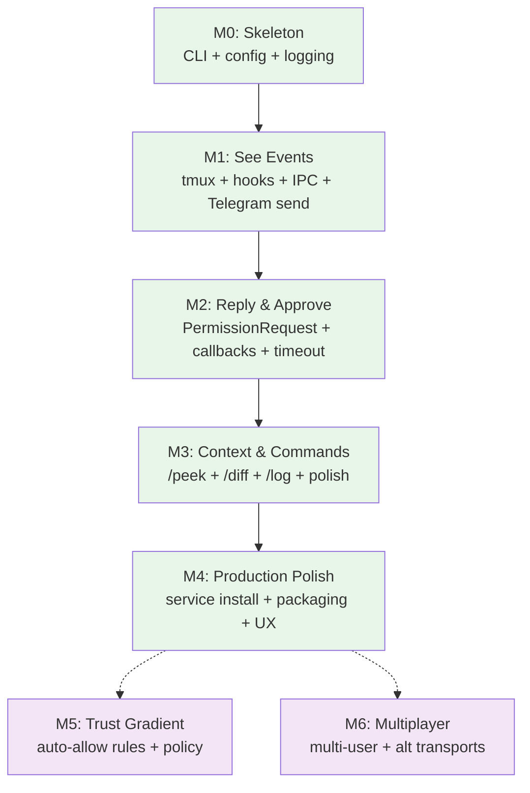

# Codelatch — Implementation Plan

> From zero to "Telegram buzzes when Claude needs you" in structured milestones.

---

## Build Philosophy

- **Vertical slices.** Each milestone delivers a usable capability end-to-end, not a horizontal layer.
- **Boring stack.** Every crate is well-maintained, widely used, and solves exactly one problem.
- **Fail-safe defaults.** At every stage, the incomplete system denies rather than allows. Safety is never deferred.
- **Test from the socket up.** Integration tests drive a real daemon, real SQLite, and a mock Telegram transport. No unit-testing internal functions in isolation unless they're complex algorithms.

---

## Milestone 0 — Project Skeleton ✅ DONE

> **Goal:** Compilable Rust project with CI, module stubs, and the ability to run `codelatch --help`.

### Deliverables

| Item | Detail |
|------|--------|
| `Cargo.toml` workspace | Crates: `codelatch` (binary), `codelatch-lib` (library with all logic) |
| CLI skeleton | `clap` with subcommands: `run`, `init`, `start`, `stop`, `status`, `doctor`, `hook`, `sessions` |
| Module stubs | Empty modules for `daemon/`, `cli/`, `db/`, `models/`, `plugin/` matching ARCHITECTURE.md layout |
| Config loading | `figment` + `toml` for `~/.config/codelatch/config.toml` with defaults |
| Logging | `tracing` + `tracing-subscriber` with `RUST_LOG` filtering |
| Error types | `thiserror` for internal, `miette` for user-facing diagnostics |
| CI | GitHub Actions: `cargo check`, `cargo test`, `cargo clippy`, `cargo fmt --check` |
| `.gitignore` | Standard Rust + SQLite + socket files |

### Acceptance Criteria

- [x] `cargo build` succeeds
- [x] `codelatch --help` prints subcommand list
- [x] `codelatch status` prints "Not configured" with a `miette` diagnostic pointing to `codelatch init`
- [x] CI green on push

---

## Milestone 1 — See Events ✅ DONE

> **Goal:** Start Claude Code in a managed tmux session. See a Telegram message when Claude does something.

### Deliverables

| Item | Detail |
|------|--------|
| `codelatch run` | Generate session ID, create tmux session, launch Claude Code with injected env vars |
| `codelatch hook <event>` | Read JSON from stdin, wrap in envelope, send to daemon over Unix socket, exit |
| Daemon: IPC server | `tokio::net::UnixListener` with `LengthDelimitedCodec` |
| Daemon: Telegram send | `teloxide` long polling + `sendMessage` for forwarded events |
| Daemon: SQLite bootstrap | Create `sessions` table, insert on first hook event from a session |
| Plugin hooks config | `hooks.json` with `Notification`, `PostToolUseFailure`, `Stop`, `SessionStart`, `SessionEnd` — all async |
| `codelatch init` | Prompt for bot token, guide pairing via `/start`, store config |
| Redaction pipeline | Basic regex patterns: API keys, JWTs, Bearer tokens |
| Daemon auto-start | `codelatch run` checks daemon socket, starts daemon if missing |

### Acceptance Criteria

- [x] `codelatch init` → prompts for token → confirms pairing → writes config
- [x] `codelatch` (alias for `run`) → opens tmux session with Claude Code inside
- [x] Claude Code asks a question → Telegram message appears on phone with 🟡 icon and context
- [x] Claude Code tool fails → Telegram message appears with ❌ icon and error
- [x] Claude Code finishes → Telegram message appears with ✅ icon
- [x] Secrets in code context are redacted before Telegram send
- [x] Daemon survives Claude Code session ending (stays running for next session)

---

## Milestone 2 — Reply and Approve ✅ DONE

> **Goal:** Answer Claude's questions from Telegram. Approve or deny permission prompts. This is where Codelatch becomes a control tool, not just notifications.

### Deliverables

| Item | Detail |
|------|--------|
| `PermissionRequest` hook | Blocking handler: send to daemon, block on socket read until decision |
| Daemon: inline keyboard | Send Allow/Deny buttons via `InlineKeyboardMarkup` on permission messages |
| Daemon: callback handler | Process `CallbackQuery` from button taps, route decision to waiting handler |
| Daemon: `pending_requests` table | Insert on permission request, update on decision/timeout |
| Daemon: timeout manager | `tokio::time::sleep` per pending request, auto-deny on expiry |
| Daemon: edit-in-place | `editMessageText` after decision: ✅ Approved / ❌ Denied / ⏳ Timed out |
| Reply injection | Match Telegram `reply_to_message_id` → session, inject via `tmux send-keys` |
| Multi-session support | `sessions` table, `/sessions` Telegram command, `/switch <name>` command |
| Daemon: singleton lock | `fs4` exclusive lock on startup |
| Daemon: graceful shutdown | `CancellationToken` fan-out on SIGINT/SIGTERM |

### Acceptance Criteria

- [x] Claude hits a permission prompt → Telegram shows 🔴 Permission message with Allow/Deny buttons
- [x] User taps Allow → message edits to ✅ Approved → Claude continues
- [x] User taps Deny → message edits to ❌ Denied → Claude stops the tool
- [x] No response in 10 min → message edits to ⏳ Timed out → auto-deny
- [x] User replies to a 🟡 Question message → reply text injected into tmux → Claude reads it
- [x] Double-tapping Allow has no effect (idempotent)
- [x] Daemon crashes and restarts → pending requests in SQLite are recovered → waiting handlers get deny (safe default)
- [x] Laptop sleeps → user taps Allow on phone → laptop wakes → daemon picks up callback → Claude continues
- [x] Two concurrent Claude sessions → each gets its own session name → messages are labeled → replies route correctly
- [x] `codelatch doctor` reports healthy status with all checks passing

---

## Milestone 3 — Context and Commands ✅ DONE

> **Goal:** Rich Telegram commands for checking on Claude. Polished message formatting. Session lifecycle messages.

### Deliverables

| Item | Detail |
|------|--------|
| `/peek` command | Current task + running command + last ~30 lines + inline buttons: Diff / Log / Stop |
| `/diff` command | `git diff` in session cwd, file attachment if >4096 chars |
| `/log` command | Last 200 lines from tmux scrollback via `capture-pane -S -200` |
| `/sessions` command | List active sessions with status |
| `/switch <name>` command | Set default session for freeform replies |
| Session lifecycle messages | 🔵 "New session: api-server-9F2KQ1" / "Session ended: api-server-9F2KQ1" |
| Rich message formatting | Telegram MarkdownV2: code blocks for commands, monospace for file paths |
| File attachments | `sendDocument` for long output (>4096 chars) |
| Stop button | "Stop" inline button on `/peek` sends SIGINT to Claude Code process in tmux |
| `codelatch status` | Pretty output: ✅ Connected · ✅ Hooks installed · ✅ tmux available · ✅ Ready |
| `codelatch doctor` | Full diagnostic: socket, Telegram auth, tmux, hooks, singleton lock |
| `codelatch doctor --fix` | Auto-fix: reinstall hooks, restart daemon |

### Acceptance Criteria

- [x] At the park: type `/peek` → see what Claude is doing, current file, running command
- [x] Type `/diff` → see git diff of what changed, formatted with syntax highlighting
- [x] Type `/log` → last 200 lines of output
- [x] Session starts → "🔵 New session: api-server-9F2KQ1" appears in Telegram
- [x] Session ends → "🔵 Session ended" appears
- [x] Large diff (>4096 chars) → sent as file attachment, not inline
- [x] Tap "Stop" on `/peek` → Claude Code receives interrupt
- [x] `codelatch status` → clean, human-readable health output
- [x] `codelatch doctor` → comprehensive diagnostic with actionable suggestions

---

## Milestone 4 — Production Polish ✅ DONE

> **Goal:** Service installation, robustness hardening, first-run UX collapse, and packaging.

### Deliverables

| Item | Detail |
|------|--------|
| Service installation | `service-manager` crate: `codelatch service install` for launchd/systemd |
| Auto-start daemon | `codelatch run` starts daemon automatically if not running (no manual `codelatch start` needed) |
| First-run collapse | First `codelatch` invocation does everything: setup + daemon + first session |
| Plugin packaging | `codelatch init` tries plugin install first, falls back to `settings.json` hooks |
| Redaction hardening | Extended patterns: GitHub tokens (`ghp_`, `gho_`), AWS keys, PEM blocks, `.env` values |
| Rate limiting | `governor` on Telegram API calls |
| Retry with backoff | `backoff` on all Telegram sends |
| Comprehensive error messages | Every failure suggests `codelatch doctor` |
| SQLite migrations | Versioned schema migrations via `sqlx`'s migration system |
| README.md | End-user documentation with setup guide |

### Acceptance Criteria

- [x] First-ever `codelatch` → guided setup → daemon started → session running → all in one flow
- [x] `codelatch service install` → launchd plist created → daemon starts on login
- [x] Telegram API rate limit hit → graceful backoff, no errors in chat
- [x] Daemon restart → recovers sessions from SQLite → no orphaned state
- [x] All user-facing errors include actionable next step
- [x] README covers: install, setup, usage, troubleshooting

---

## Milestone 5 — Trust Gradient (Future)

> **Goal:** Auto-allow rules and policy engine. Reduce signal-to-noise ratio on permission prompts.

### Deliverables (Stretch)

| Item | Detail |
|------|--------|
| Auto-allow rules | Config-based: `auto_allow = ["git status", "cat *", "ls *"]` — read-only commands that never need human approval |
| Pattern matching | Regex rules in config: `auto_allow_patterns = ["^npm (test|run lint)"]` |
| Audit log | SQLite table logging all auto-allow decisions for transparency |
| `/rules` command | Telegram command to view and manage auto-allow rules |
| Policy escalation | Future: LLM evaluates ambiguous actions, auto-decides clear cases, escalates unclear ones |

### Acceptance Criteria

- [ ] `git status` auto-allowed without Telegram prompt
- [ ] `npm test` auto-allowed via pattern rule
- [ ] `rm -rf` still prompts in Telegram (not matched by any rule)
- [ ] `/rules` shows active auto-allow rules
- [ ] Audit log captures every auto-allowed action

### Estimated Effort: 3–5 days

---

## Milestone 6 — Multiplayer and Alternative Transports (Future)

> **Goal:** Multi-user supervision and transport-agnostic architecture.

### Deliverables (Stretch)

| Item | Detail |
|------|--------|
| Multi-user auth | Multiple authorized `chat_id`s in config |
| Role-based routing | Route destructive operations to senior engineer, read-only to junior |
| Slack transport | Alternative transport module for Slack API |
| Discord transport | Alternative transport module for Discord |
| Encrypted direct channel | Matrix or Signal protocol for E2E encrypted supervision |

### Estimated Effort: 2–4 weeks

---

## Cross-Cutting Concerns

### Testing Strategy

| Layer | Approach |
|-------|----------|
| **IPC protocol** | Integration tests: spawn a real daemon, connect a mock hook handler, verify envelope roundtrip |
| **Telegram transport** | Mock HTTP server replacing `api.telegram.org`, verify message formatting and callback handling |
| **SQLite** | In-memory SQLite for all tests, verify state transitions and idempotency |
| **tmux** | Integration tests with real tmux sessions (CI will need tmux installed) |
| **End-to-end** | Script: `codelatch run`, trigger a hook event, verify Telegram mock receives correct message |
| **Redaction** | Unit tests with known secret patterns, verify they're stripped |

### Error Handling Philosophy

```
Level 1: Internal errors (thiserror)
  → Module boundaries, pattern matching, typed recovery

Level 2: User-facing errors (miette)
  → CLI output: what went wrong + what to do next
  → Always suggest: "Run `codelatch doctor`"

Level 3: Fail-safe defaults
  → Daemon unreachable → deny
  → Timeout → deny
  → SQLite corruption → deny + diagnostic
  → Telegram API error → retry with backoff → eventual deny
```

### Observability

- Structured logging via `tracing` with span context (session_id, request_id).
- Log levels: `WARN` for recoverable issues, `ERROR` for failures, `INFO` for lifecycle events, `DEBUG` for IPC traffic.
- `RUST_LOG=codelatch=debug` for development.
- Logs go to stderr (or journal if running as service).

---

## Dependency Graph (Build Order)



> **Legend:** 🟢 Green = finished · 🟣 Purple = future

---

## Timeline Summary

| Milestone | Calendar Time | Status |
|-----------|---------------|--------|
| **M0:** Skeleton | 1–2 days | DONE |
| **M1:** See Events | 5–7 days | DONE |
| **M2:** Reply & Approve | 7–10 days | DONE |
| **M3:** Context & Commands | 4–6 days | DONE |
| **M4:** Production Polish | 5–7 days | DONE |
| **M5:** Trust Gradient | 3–5 days | Future |
| **M6:** Multiplayer | 2–4 weeks | Future |

---

## Risk Register

| Risk | Impact | Likelihood | Mitigation |
|------|--------|------------|------------|
| Claude Code hooks API changes | High | Low | Pin to known-good version, abstract hook I/O behind internal types |
| Telegram rate limits during burst events | Medium | Medium | `governor` rate limiter, batch noisy events, backoff |
| tmux not installed on user machine | High | Low | `codelatch doctor` checks for tmux, install guide in error message |
| Long-running blocked hook handlers OOMing | Low | Low | Handlers are tiny — read JSON, write to socket, block on read. No memory growth. |
| SQLite corruption | Medium | Very Low | WAL mode, periodic `PRAGMA integrity_check` in `codelatch doctor` |
| User has multiple Telegram bots | Low | Low | Each bot has its own token. Config is per-installation. |
| Plugin system unavailable (old Claude Code) | Medium | Medium | Fallback to `~/.claude/settings.json` hook installation |
